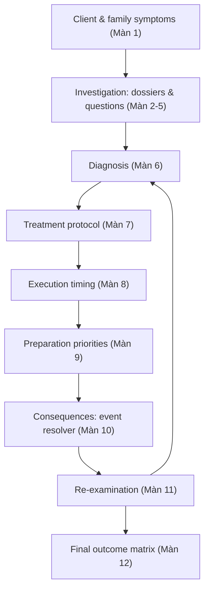
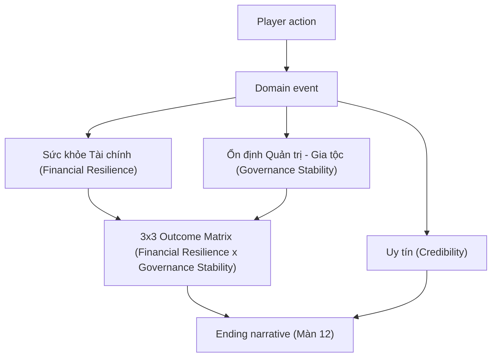

## 4. Project Logic Chain

### 4.1 Product Logic



### 4.2 Engine Logic

```text
Player edits draft selection
-> validate selection limit (e.g. 3/7 dossiers, 2/7 questions, 1/6 diagnosis, 1/6 protocol, 1/4 timing, 3/7 priorities), cost and preconditions
-> player presses Confirm
-> read current confirmed state
-> apply immediate effects
-> evaluate conditional effects (Credibility gates, timing/preparation modifiers)
-> write immutable next state; permanently lock unselected dossiers
-> unlock evidence/content
-> emit events
-> update scoring components (Credibility, Financial Resilience, Governance Stability)
-> show feedback
-> move to next node
```

### 4.3 Scoring Logic



Important separation:

| Pillar | What It Measures | What It Must Not Do |
|---|---|---|
| Uy tín (Credibility) | How much the board and market trust the player's decisions — rises or falls with evidence-backed vs. unfounded choices (e.g., picking CD-F without HS-D coverage, or changing diagnosis/treatment at Màn 11 without new evidence). | Must not be treated as a hidden score to chase on its own — it also gates which protocols are even selectable (PD-A needs medium Credibility, PD-F needs high Credibility). |
| Sức khỏe Tài chính (Financial Resilience) | Simulated liquidity, debt relief and operating momentum, computed from the point formula tied to protocol, timing and preparation choices (Màn 7-8-9-10). | Must not replace correct diagnosis/treatment reasoning — a high point total does not mean the root cause was actually addressed. |
| Ổn định Quản trị - Gia tộc (Governance Stability) | Whether David keeps control of the family in relative peace, computed from HS-G, the priority groups chosen at Màn 9, and any Credibility lost along the way. | Must not be inferred purely from the Financial Outcome — a financially healthy company can still land in "Mất kiểm soát" if the family axis collapses. |

### 4.4 Claim Logic

Every feedback message should follow:

```text
Result -> Reason -> Meaning -> Action -> Limit
```

Example:

```text
Result: Your PD-E (Bankrupt with Reorganization) plan struggled in this run.
Reason: You chose TG-A (execute immediately) and did not prioritize Suppliers at Màn 9, so the protocol's Financial Resilience modifier flipped from +1 (with Suppliers priority) to -2, and vendors read the immediate filing as a sign of hidden bad news.
Meaning: The protocol addressed the real capital-structure disease, but execution timing and missing supplier preparation still damaged vendor trust and holiday inventory.
Action: In a revised plan, prioritize Suppliers (and ideally Holiday Inventory) at Màn 9 and avoid TG-A/TG-D so the timing and preparation modifiers turn positive instead of negative.
Limit: These point values are an educational simulation assumption for teaching cause-and-effect, not a real bankruptcy or restructuring forecast.
```

---
