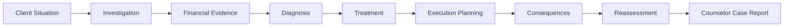

# 🩺 MEDIFIN — Inside the Mind of a Counselor

> **A scenario-based financial counseling simulation for Finance and Banking students.**

MEDIFIN puts the player in the role of a **Junior Financial Counselor** who must investigate incomplete financial information, identify the client's primary financial problem, recommend an appropriate response, and reassess the decision after observing its consequences.

> **Investigate → Diagnose → Treat → Execute → Observe Consequences → Reassess → Learn**

---

## 1. Current MVP

### Case #01 — Toy Kingdom Inc.

The current MVP focuses on **one complete corporate financial counseling case**.

Toy Kingdom is a retail company facing multiple pressures, including:

- competitive pressure;
- liquidity constraints;
- reinvestment needs;
- high financial leverage; and
- governance conflicts.

The player must answer:

> **What is the company's primary financial problem, and what should be done about it?**

The case is implemented through a **13-screen / 6-phase decision flow**.

| Phase | Main Task |
|---|---|
| **1. Client Intake & Investigation** | Understand the case and collect evidence |
| **2. Diagnosis** | Identify the primary financial problem |
| **3. Treatment & Execution Planning** | Select treatment, timing, and stakeholder priorities |
| **4. Consequence** | Observe the effects of previous decisions |
| **5. Reassessment** | Keep or revise professional judgment |
| **6. Final Assessment** | Receive the Counselor Case Report |

---

## 2. Main Product Output

At the end of the case, the player receives a **Counselor Case Report**.

It contains two separate results:

### Counselor Performance

Evaluates the quality of the player's decision process across:

**Investigation · Diagnosis · Treatment · Execution Planning · Reassessment**

### Case Outcome

Shows the simulated impact on:

**Financial Resilience · Governance Stability · Final Ending**

> **Decision Quality ≠ Company Outcome**

The purpose is not only to give the player a score, but to explain **why the result occurred and how the player's financial reasoning could improve**.

---

## 3. Product Structure

MEDIFIN is designed as a **decision simulation rather than a traditional correct/incorrect quiz**.

Player choices influence later evidence, consequences, feedback, and the final case outcome.

---

## 4. Repository Evidence

The repository documents the development of MEDIFIN from problem definition to a testable product.

### Week 1 — Problem Direction

**Focus:** What problem are we solving?

- Financial Clinic concept
- Target user
- Problem candidates
- Core user task
- Initial problem statement

---

### Week 2 — Product Direction & Solution Structure

**Focus:** What exactly are we building?

- [PROJECT_PROPOSAL.md](WEEK%202/PROJECT_PROPOSAL.md)
- [SOLUTION_STRUCTURE.md](WEEK%202/SOLUTION_STRUCTURE.md)

**Key Output:**  
MEDIFIN was defined as a **scenario-based financial counseling simulation** with one complete decision flow and a Counselor Case Report as the main output.

---

### Week 3 — Information & Evidence Readiness

**Focus:** What information must be ready?

- [INPUT_DICTIONARY.md](WEEK%203/INPUT_DICTIONARY.md)
- [SOURCE_USE_MAP.md](WEEK%203/SOURCE_USE_MAP.md)
- [ASSUMPTIONS.md](WEEK%203/ASSUMPTIONS.md)
- [SAMPLE_INPUT_OUTPUT.md](WEEK%203/SAMPLE_INPUT_OUTPUT.md)

**Key Output:**  
Case inputs, financial evidence, sources, assumptions, and expected uses were documented before implementation.

---

### Week 4 — Decision Logic & Midterm Readiness

**Focus:** How does MEDIFIN decide?

- [PROJECT_LOGIC_CHAIN.md](WEEK%204/PROJECT_LOGIC_CHAIN.md)
- [DECISION_RULES_AND_SCORING.md](WEEK%204/DECISION_RULES_AND_SCORING.md)
- [EXPECTED_RESULT_AND_LOGIC_TEST.md](WEEK%204/EXPECTED_RESULT_AND_LOGIC_TEST.md)
- [MIDTERM_REVIEW.md](WEEK%204/MIDTERM_REVIEW.md)

**Key Output:**  
The team defined the complete:

> **Input → Decision Logic → Consequence → Reassessment → Output**

Counselor Performance and Case Outcome are evaluated separately.

---

### Week 5 — Product Refinement

**Focus:** How will the user experience the product?

- [FEATURE_MAP.md](WEEK%205/FEATURE_MAP.md)
- [USER_FLOW.md](WEEK%205/USER_FLOW.md)
- [WORKING_INTERFACE_DRAFT_AND_REVISION_EVIDENCE.md](WEEK%205/WORKING_INTERFACE_DRAFT_AND_REVISION_EVIDENCE.md)

**Key Output:**

> **Refined Flow + Clearer Interface + Cut Decisions + Visible Ownership**

Week 5 focuses on making one complete Case #01 easier to use, test, and integrate before Week 6.

---

## 5. Working Prototype

### UI/UX Draft

🎨 [Canva — MEDIFIN UI/UX Draft](https://www.canva.com/design/DAHUrjuo2iU/TwEgLcpHq5jNEXqZxAyq5Q/edit?ui=eyJBIjp7fX0)

### Interactive Prototype

🖥️ [Figma — MEDIFIN Interactive Prototype](https://www.figma.com/proto/VtlhknTup0qQw5TX7OhloF/Medifin?node-id=1-14&p=f&t=Q6iSnSJUCTCF9sF1-0&scaling=min-zoom&content-scaling=fixed&page-id=1%3A8&starting-point-node-id=1%3A14)

The current development priority is:

> **Prototype → Frontend → Game Logic Integration → Complete Playable Case**

---

## 6. Team Members & Ownership

| Member | Student ID | Role / Responsibility | Main Contribution |
|---|---|---|---|
| **Nguyễn Phương Khuê** | 2413380023 | Project Coordinator & Scenario Designer | Scenario structure, storyline, and case progression |
| **Trương Vĩnh Thịnh** | 2412380046 | Frontend & Integration Developer | Playable frontend and integration of UI, financial data, and game logic |
| **Lâm Diệu Anh** | 2413380007 | Financial Content Lead | Financial data, evidence, diagnosis/treatment content, and financial feedback |
| **Bùi Lê Trà Giang** | 2413380015 | UI/UX Designer & Dialogue Writer | Screen flow, Canva/Figma prototype, dialogue, and interface design |
| **Lê Bảo Ngọc** | 2412380033 | Game Engine & Logic Developer | Decision rules, scoring, consequence logic, and main game engine |

### Shared Working Folder

📁 [MEDIFIN — NHÓM 2](https://docs.google.com/document/d/1LDxYMVNUmx3nDv6oSetyHl7smptbk7PI986ljM8tMw4/edit?tab=t.0)

---

## 7. MVP Scope

### Current MVP

> **One complete playable Case #01 — Toy Kingdom Inc.**

### Keep

- Investigation
- Diagnosis
- Treatment & Execution
- Consequence
- Reassessment
- Counselor Case Report

### Simplify

- Governance / family storyline where it distracts from financial reasoning

### Postpone

- Additional cases
- Controlled scenario variation
- Advanced animations and visual effects

### Out of Scope

- Multiplayer
- Real-time financial data
- AI-generated cases
- Open-ended AI chatbot
- 3D / Open World
- Real-money transactions

---

## 8. Current Status

**Current Stage:** Week 5 — Product Refinement

**Product:** MEDIFIN — Financial Clinic  
**Product Pattern:** Scenario-Based Decision Simulation  
**Current Case:** Toy Kingdom Inc.  
**MVP:** 1 Complete Playable Case  
**Interface:** Interactive Prototype Available  
**Decision Logic:** Defined  
**Current Priority:** Frontend & Game Logic Integration

> **Goal before Week 6: one complete, understandable, and testable Case #01 flow.**
