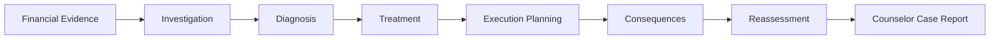

# 🩺 MEDIFIN — Inside the Mind of a Counselor

> **A scenario-based financial counseling simulation for Finance and Banking students.**

MEDIFIN puts the player in the role of a **Junior Financial Counselor** who must investigate incomplete financial information, identify the client's primary financial problem, recommend a treatment, observe its consequences, and reassess the decision.

> **Investigate → Diagnose → Treat → Execute → Observe → Reassess → Learn**

---

## 1. Current MVP

### Case #01 — Toy Kingdom Inc.

The current MVP focuses on **one complete playable financial counseling case** inspired by the historical Toys "R" Us case.

Toy Kingdom faces multiple pressures, including:

- competitive pressure;
- liquidity constraints;
- reinvestment needs;
- high financial leverage;
- refinancing pressure; and
- governance conflicts.

The player must determine:

> **What is the company's primary financial problem, and what should be done about it?**

The case follows a **13-screen / 6-phase flow**:

| Phase | Main Task |
|---|---|
| **1. Client Intake & Investigation** | Collect and analyze relevant financial evidence |
| **2. Diagnosis** | Identify the primary financial problem |
| **3. Treatment & Execution Planning** | Select treatment, timing, and stakeholder priorities |
| **4. Consequence** | Observe the effects of previous decisions |
| **5. Reassessment** | Maintain or revise professional judgment |
| **6. Final Assessment** | Receive the Counselor Case Report |

---

## 2. Live Working Build

### 🎮 Play MEDIFIN

**[Launch Case #01 — Toy Kingdom Inc.](https://kirisakitrangngocbk-a11y.github.io/Medifin/)**

### Current Build Status

| Component | Status |
|---|---|
| 13-screen / 6-phase core flow | ✅ Working |
| Financial case data | ✅ Integrated |
| Investigation & Diagnosis | ✅ Working |
| Treatment & Execution Planning | ✅ Working |
| Counselor Performance Scoring | ✅ Working |
| Reassessment | ✅ Working |
| Counselor Case Report | ✅ Working |
| Decision-to-Outcome Rules | 🟡 Refinement / Testing |
| Consequence Calibration | 🟡 Refinement / Testing |
| Public Build | ✅ Deployed |

The current Week 6 priority is:

> **Integration → Testing → Bug Fixing → Stabilization**

rather than adding new major features.

---

## 3. How MEDIFIN Works

```mermaid
flowchart LR
    A["Financial Evidence"] --> B["Investigation"]
    B --> C["Diagnosis"]
    C --> D["Treatment"]
    D --> E["Execution Planning"]
    E --> F["Consequences"]
    F --> G["Reassessment"]
    G --> H["Counselor Case Report"]
```

MEDIFIN is designed as a **decision simulation rather than a traditional correct/incorrect quiz**.

Player decisions are evaluated in context, and different choices may create different financial trade-offs and consequences.

---

## 4. Main Output

At the end of the case, the player receives a **Counselor Case Report**.

The report separates two types of results:

### Counselor Performance

Evaluates the quality of the player's decision process:

| Component | Weight |
|---|---:|
| Investigation | 20% |
| Diagnosis | 30% |
| Treatment | 20% |
| Execution Planning | 15% |
| Reassessment | 15% |
| **Total** | **100%** |

### Company Outcome

Shows the simulated condition of Toy Kingdom through:

> **Financial Resilience + Governance Stability → Final Case Outcome**

Therefore:

> **Decision Quality ≠ Company Outcome**

A reasonable decision may still lead to a difficult company outcome when the company begins from a financially constrained position.

---

## 5. Project Evidence

The repository documents the development of MEDIFIN from problem definition to a working and testable MVP.

### Week 1 — Problem Direction

**Focus:** What problem are we solving?

- Financial Clinic concept
- Target user
- Core problem
- Initial product direction

---

### Week 2 — Product Direction & Solution Structure

**Focus:** What exactly are we building?

- [PROJECT_PROPOSAL.md](WEEK%202/PROJECT_PROPOSAL.md)
- [SOLUTION_STRUCTURE.md](WEEK%202/SOLUTION_STRUCTURE.md)

**Key Output:**  
MEDIFIN was defined as a **scenario-based financial counseling simulation** with one complete case as the MVP.

---

### Week 3 — Information & Evidence Readiness

**Focus:** What information does the product need?

- [INPUT_DICTIONARY.md](WEEK%203/INPUT_DICTIONARY.md)
- [SOURCE_USE_MAP.md](WEEK%203/SOURCE_USE_MAP.md)
- [ASSUMPTIONS.md](WEEK%203/ASSUMPTIONS.md)
- [SAMPLE_INPUT_OUTPUT.md](WEEK%203/SAMPLE_INPUT_OUTPUT.md)

**Key Output:**  
Case inputs, financial evidence, historical sources, simulation assumptions, and expected information use were documented before implementation.

---

### Week 4 — Decision Logic & Midterm Readiness

**Focus:** How does MEDIFIN make decisions and evaluate the player?

- [PROJECT_LOGIC_CHAIN.md](WEEK%204/PROJECT_LOGIC_CHAIN.md)
- [DECISION_RULES_AND_SCORING.md](WEEK%204/DECISION_RULES_AND_SCORING.md)
- [EXPECTED_RESULT_AND_LOGIC_TEST.md](WEEK%204/EXPECTED_RESULT_AND_LOGIC_TEST.md)
- [MIDTERM_REVIEW.md](WEEK%204/MIDTERM_REVIEW.md)

**Key Output:**

> **Input → Decision Logic → Consequence → Reassessment → Output**

Financial calculations, decision criteria, scoring logic, and expected results were defined.

---

### Week 5 — Product Refinement

**Focus:** How does the user experience the product?

- [FEATURE_MAP.md](WEEK%205/FEATURE_MAP.md)
- [USER_FLOW.md](WEEK%205/USER_FLOW.md)
- [INTERFACE_DRAFT.md](WEEK%205/INTERFACE_DRAFT.md)

**Key Output:**

> **Refined Flow + Clearer Interface + Cut Decisions + Visible Ownership**

The product was refined into a clearer **13-screen / 6-phase user journey** before implementation and integration.

---

### Week 6 — Working Build, Integration & Testing

**Focus:** Does the core product actually work end-to-end?

- [CORE_FLOW_AND_INTEGRATION.md](WEEK%206/CORE_FLOW_AND_INTEGRATION.md)
- [TEST_CASES.md](WEEK%206/TEST_CASES.md)
- [BUG_LOG.md](WEEK%206/BUG_LOG.md)
- [SCOPE_FREEZE.md](WEEK%206/SCOPE_FREEZE.md)

**Key Output:**

> **Working Core Flow → Integration → Testing → Bug Fixing → Scope Freeze**

Week 6 connects the previous product structure, financial logic, user flow, and interface into a **playable and testable MVP**.

---

## 6. Working Prototype & Interface

### UI/UX Draft

🎨 [Canva — MEDIFIN UI/UX Draft](https://www.canva.com/design/DAHUrjuo2iU/TwEgLcpHq5jNEXqZxAyq5Q/edit?ui=eyJBIjp7fX0)

### Interactive Prototype

🖥️ [Figma — MEDIFIN Interactive Prototype](https://www.figma.com/proto/VtlhknTup0qQw5TX7OhloF/Medifin?node-id=1-14&p=f&t=Q6iSnSJUCTCF9sF1-0&scaling=min-zoom&content-scaling=fixed&page-id=1%3A8&starting-point-node-id=1%3A14)

### Playable Build

🎮 [MEDIFIN — Live Case #01](https://kirisakitrangngocbk-a11y.github.io/Medifin/)

The development route is now:

> **Prototype → Integrated Build → Testing → Stabilized MVP**

---

## 7. Team Members & Ownership

| Member | Student ID | Role / Responsibility |
|---|---|---|
| **Nguyễn Phương Khuê** | 2413380023 | Project Coordinator & Scenario Designer |
| **Trương Vĩnh Thịnh** | 2412380046 | Frontend & Integration Developer |
| **Lâm Diệu Anh** | 2413380007 | Financial Content Lead |
| **Bùi Lê Trà Giang** | 2413380015 | UI/UX Designer & Dialogue Writer |
| **Lê Bảo Ngọc** | 2412380033 | Game Engine & Logic Developer |

Detailed contribution evidence is recorded in:

**[MEMBER_CONTRIBUTION.md](MEMBER_CONTRIBUTION.md)**

---

## 8. Frozen MVP Scope

### Included

- One complete Case #01
- 13 screens / 6 phases
- Financial evidence investigation
- Diagnosis
- Treatment & Execution Planning
- Consequence
- Reassessment
- Counselor Performance
- Company Outcome
- Counselor Case Report

### Postponed / Out of Scope

- Additional cases
- Open-ended AI chatbot
- AI-generated scenarios
- Custom company financial uploads
- Real-time financial data
- Multiplayer
- Advanced visual effects

The current priority is to make **one case complete, explainable, stable, and testable** before expanding MEDIFIN.

---

## 9. Current Status

**Current Stage:** Week 6 — Working Build, Integration & Testing  
**Product:** MEDIFIN — Financial Clinic  
**Product Pattern:** Scenario-Based Decision Simulation  
**Current Case:** Toy Kingdom Inc.  
**MVP:** One Complete Playable Case  
**Core Flow:** Working  
**Public Build:** Deployed  
**Testing:** In Progress  
**Current Priority:** Decision Logic Refinement, Testing & Stabilization

> **Week 6 Goal: one connected, financially explainable, and testable Case #01 from player input to final Counselor Case Report.**
