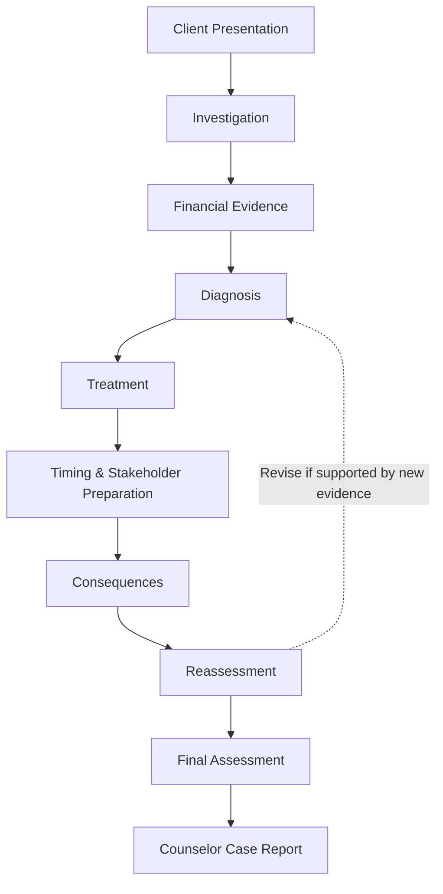

# PROJECT LOGIC CHAIN

## Case #01 — Toy Kingdom Inc.

> Educational financial simulation inspired by the historical Toys "R" Us case.

---

## 1. Purpose

This document defines how MEDIFIN transforms case information and player decisions into an explainable financial counseling outcome.

The core logic is:

**Input / State → Investigation → Diagnosis → Treatment → Execution → Consequence → Reassessment → Final Output**

Detailed scoring formulas, weights, thresholds, and outcome calculations are documented separately in `DECISION_RULES_AND_SCORING.md`.

---

## 2. Project Logic Chain

| Stage | MEDIFIN |
|---|---|
| **Problem** | Finance students may understand financial concepts individually but struggle to combine incomplete information, identify the primary financial problem, and recommend an appropriate response. |
| **Target User** | Finance, Banking, Accounting, and Business students with basic financial-statement knowledge. |
| **User Task** | Act as a Junior Financial Counselor: investigate the client, identify relevant financial problems, determine the primary diagnosis, recommend a treatment, plan execution, and reassess after new developments. |
| **Difficulty** | The client presents several plausible problems at the same time. Information is limited, some clues are more decision-relevant than others, and a reasonable treatment may still perform poorly if timing or stakeholder preparation is weak. |
| **Technology Support** | MEDIFIN structures the case as an interactive decision simulation, controls information access, records player decisions, applies predefined rules, generates consequences, and provides explainable feedback. |
| **Input / State** | Case financial data, business/governance information, controlled scenario variables, evidence discovered by the player, and confirmed player decisions. |
| **Decision Logic** | Evaluate evidence → assess diagnosis → evaluate treatment fit → apply timing and stakeholder conditions → generate consequences → reassess the decision. |
| **Output** | Counselor performance assessment, simulated company outcome, explanatory feedback, and final Counselor Case Report. |
| **User Action** | Review the result, understand the reasoning and trade-offs, and replay the case using a different investigation or decision path. |

---

## 3. Case Logic Flow



### Phase 1 — Investigation

The player receives the client's initial presentation without receiving a confirmed explanation of the underlying problem.

The player then:

- selects **3 of 7 Diagnostic Files**;
- selects **2 Follow-Up Questions**;
- reviews the full financial statements;
- selects **1 Final Diagnostic Question**.

The investigation determines which evidence is available for later decisions.

**Logic principle:** information is not equally useful. The player must prioritize evidence under limited access.

### Phase 2 — Diagnosis

The player uses discovered evidence to identify the financial problems affecting the client and determine the **Primary Diagnosis**.

Diagnosis quality depends on:

- relevance of the problems identified;
- identification of the primary constraint;
- consistency with evidence actually discovered.

A plausible diagnosis without sufficient evidence should not be evaluated the same as an evidence-supported diagnosis.

### Phase 3 — Treatment & Execution

After diagnosis, the player selects:

1. a **Treatment**;
2. an **Execution Timing**;
3. three **Stakeholder Priorities**.

The game evaluates these decisions as a combined plan rather than as independent answers.

```text
Diagnosis
    ↓
Treatment Fit
    ↓
Timing
    ↓
Stakeholder Preparation
    ↓
Execution Quality
```

A treatment may address an important financial problem but still produce a weak outcome if timing or stakeholder preparation is poorly managed.

### Phase 4 — Consequence

The game applies predefined scenario rules to the confirmed decisions.

Consequences may affect areas such as:

- Sales
- Liquidity
- Debt
- Suppliers
- Stores
- Digital investment
- Governance / Family

The resulting developments depend on the player's decisions and the current case state.

**Controlled scenario variation may change the strength of selected conditions, but it must not randomly determine whether the player succeeds or fails.**

### Phase 5 — Reassessment

After observing new developments, the player may reconsider the diagnosis and treatment.

The purpose is to test whether the player can update professional judgment when new evidence becomes available.

Therefore:

- keeping the original decision can be reasonable if new evidence still supports it;
- changing the decision can be reasonable if new evidence materially changes the case;
- the quality of the reasoning matters more than whether the player simply changes or keeps the original answer.

### Phase 6 — Final Assessment

MEDIFIN produces two different types of results:

#### A. Counselor Performance

Evaluates **how well the player made decisions**, including:

- Investigation
- Diagnosis
- Treatment
- Timing
- Stakeholder Preparation
- Reassessment

#### B. Case Outcome

Evaluates **what happens to the simulated company** after the player's decisions.

The case outcome is represented through:

- **Financial Resilience**
- **Governance Stability**

These dimensions determine the final case ending.

> **Counselor Performance and Case Outcome are not the same thing.**

A player may make a well-supported professional decision while the company still faces a difficult outcome because of its starting financial condition and execution constraints.

---

## 4. Input → Logic → Output Mapping

| Input / State | Financial Meaning | Logic / Process | Output |
|---|---|---|---|
| Financial statements and operating indicators | Current financial condition | Compare operating performance, financing burden, liquidity, and business trends | Financial evidence |
| Diagnostic Files selected | Evidence intentionally investigated | Reveal selected information and preserve information gaps | Available evidence set |
| Follow-Up Questions | Additional clarification | Add narrower evidence to support or challenge the current interpretation | Additional evidence |
| Diagnosis selections | Player's interpretation of the case | Compare diagnosis with relevant discovered evidence and the primary constraint | Diagnosis assessment |
| Treatment | Proposed financial response | Evaluate fit with diagnosis, feasibility, and major constraints | Treatment assessment |
| Timing | When the treatment is executed | Apply timing-specific opportunities and risks | Timing effect |
| Stakeholder Priorities | Preparation for implementation | Evaluate whether decision-critical stakeholders are sufficiently addressed | Stakeholder effect |
| Treatment + Timing + Stakeholders | Complete execution plan | Apply predefined consequence rules | Case developments |
| New developments | Updated case state | Compare new information with the original judgment | Reassessment opportunity |
| Reassessment decision | Updated professional judgment | Evaluate whether the player responds appropriately to new evidence | Reassessment assessment |
| Complete player path | Overall decision process | Combine stage assessments | Counselor Performance |
| Simulated company state | Financial and governance condition after decisions | Apply outcome rules | Financial Resilience + Governance Stability → Final Ending |

---

## 5. Decision Logic Principles

### 5.1 Evidence Before Conclusion

A diagnosis or recommendation should be evaluated against evidence available to the player.

```text
Evidence
→ Reasoning
→ Decision
```

not:

```text
Decision
→ Find evidence afterwards
```

### 5.2 Criteria Before Score

The game first determines **why** a decision is strong or weak and only then converts that assessment into a score.

Scores therefore represent predefined decision criteria rather than arbitrary rewards.

### 5.3 Diagnosis Before Treatment

Treatment suitability depends on the financial problems identified and the player's Primary Diagnosis.

A treatment should not be considered strong simply because it produces a favorable short-term result.

### 5.4 Execution Matters

The same treatment can produce different consequences depending on:

- timing;
- stakeholder preparation;
- case conditions.

Therefore:

**Correct Diagnosis ≠ Automatically Successful Outcome**

and:

**Appropriate Treatment ≠ Automatically Successful Execution**

### 5.5 Reassessment Uses New Evidence

The player should be evaluated on whether judgment is updated appropriately when new information appears.

Changing a decision is not automatically good or bad, and keeping the original decision is not automatically good or bad.

---

## 6. Output Logic

Major MEDIFIN feedback follows:

**Result → Reason → Meaning → Action → Limit**

Example:

> **Result:** Your treatment addressed an important financing constraint.  
>
> **Reason:** The recommendation was consistent with the leverage and interest-burden evidence discovered during investigation.  
>
> **Meaning:** The plan may improve financial flexibility, but operating weaknesses remain.  
>
> **Action:** Consider whether implementation also addresses the stakeholders and operating constraints required for recovery.  
>
> **Limit:** This consequence is an educational simulation and should not be interpreted as a prediction of real restructuring success.

This structure ensures that MEDIFIN explains the reasoning behind an outcome instead of displaying only a score.

---

## 7. Claim Boundary

MEDIFIN is an **educational decision simulation**, not a professional financial advisory or bankruptcy prediction model.

| Output Type | What MEDIFIN May Claim | Boundary |
|---|---|---|
| **Calculation** | A financial value derived from stated case inputs | Depends on the accuracy and assumptions of those inputs |
| **Classification** | A decision is more or less supported by available evidence | Based on predefined educational criteria |
| **Recommendation** | A treatment is more suitable under the simulated case conditions | Not professional advice or proof of real-world success |
| **Simulation Consequence** | A decision leads to a defined scenario development | Educational counterfactual, not a forecast |

Historical evidence, fictional adaptations, simulation assumptions, and player-generated states must remain distinguishable throughout the case.

---

## 8. Week 4 Document Boundary

This document defines **MEDIFIN's overall reasoning chain**.

Detailed Week 4 logic is documented separately in:

- `DECISION_RULES_AND_SCORING.md` — decision criteria, calculations, scoring, and outcome rules;
- `EXPECTED_RESULT_AND_LOGIC_TEST.md` — sample inputs with predicted outputs for logic validation;
- `MIDTERM_READINESS.md` — evidence index, implementation status, and remaining work.

This separation allows a reviewer to understand the product logic before reviewing its detailed scoring and implementation.
