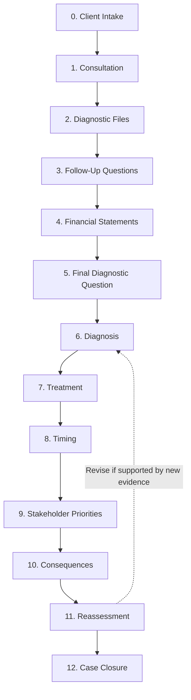

# PROJECT LOGIC CHAIN

## Case #01 — Toy Kingdom Inc.

> Educational financial simulation inspired by the historical Toys "R" Us case.

---

## 1. Purpose

This document explains how MEDIFIN transforms case information and player decisions into an explainable financial counseling outcome.

The core logic is:

**Input / State → Investigation → Diagnosis → Treatment → Execution → Consequence → Reassessment → Final Output**

Detailed formulas, decision rules, scoring, and outcome thresholds are documented separately in `DECISION_RULES_AND_SCORING.md`.

---

## 2. Project Logic Chain

| Stage | MEDIFIN |
|---|---|
| **Problem** | Finance students may understand individual financial concepts but struggle to combine incomplete information, distinguish symptoms from underlying problems, and recommend an appropriate response. |
| **Target User** | Finance, Banking, Accounting, and Business students with basic financial-statement knowledge. |
| **User Task** | Act as a Junior Financial Counselor: investigate the client, identify relevant financial problems, determine the Primary Diagnosis, recommend a treatment, plan its execution, and reassess the decision after new developments. |
| **Difficulty** | Several plausible problems appear at the same time. Information is limited, clues differ in relevance, and even a reasonable treatment can perform poorly if timing or stakeholder preparation is weak. |
| **Technology Support** | MEDIFIN provides an interactive case environment that controls information access, records decisions, applies predefined rules, generates consequences, and provides explainable feedback. |
| **Input / State** | Financial data, business/governance information, scenario conditions, evidence discovered by the player, and confirmed player decisions. |
| **Decision Logic** | Evidence → Diagnosis → Treatment Fit → Execution Conditions → Consequence → Reassessment. |
| **Output** | Counselor Performance, simulated Case Outcome, explanatory feedback, and a final Counselor Case Report. |
| **User Action** | Review the result, understand the reasoning and trade-offs, and replay the case using a different investigation or decision path. |

---

## 3. Case Structure

Case #01 contains **13 screens (Screen 0–12)** organized into **6 decision phases**.

| Phase | Screens | Main Task |
|---|---|---|
| **Phase 1 — Client Intake & Investigation** | Screen 0–5 | Understand the client, select evidence, review financial information, and ask diagnostic questions. |
| **Phase 2 — Diagnosis** | Screen 6 | Identify relevant financial problems and determine the Primary Diagnosis. |
| **Phase 3 — Treatment & Execution Planning** | Screen 7–9 | Select a treatment, execution timing, and stakeholder priorities. |
| **Phase 4 — Consequence** | Screen 10 | Observe developments generated by the selected plan. |
| **Phase 5 — Reassessment** | Screen 11 | Reconsider the diagnosis and treatment using new developments. |
| **Phase 6 — Final Assessment** | Screen 12 | Receive Counselor Performance, Case Outcome, feedback, and the Counselor Case Report. |

### Screen-Level Flow

---

## 4. Phase Logic

### Phase 1 — Client Intake & Investigation

The player first receives the client's description of the problem without being given a confirmed root cause.

The player then:

- selects **3 of 7 Diagnostic Files**;
- selects **2 Follow-Up Questions**;
- reviews the full financial statements;
- selects **1 Final Diagnostic Question**.

The choices determine which evidence is available for later decisions.

**Core logic:** limited information forces the player to prioritize evidence rather than inspect everything.

---

### Phase 2 — Diagnosis

The player interprets the available evidence and determines the **Primary Diagnosis**.

Diagnosis quality depends on:

- relevance of the identified problem;
- identification of the primary financial constraint;
- support from evidence actually discovered.

**Core logic:**

**Evidence → Reasoning → Diagnosis**

A plausible diagnosis without sufficient evidence is weaker than an evidence-supported diagnosis.

---

### Phase 3 — Treatment & Execution Planning

The player selects:

1. **Treatment**
2. **Execution Timing**
3. **Three Stakeholder Priorities**

These choices form one complete implementation plan.

**Core logic:**

**Diagnosis → Treatment Fit → Timing → Stakeholder Preparation → Execution Quality**

A suitable treatment may still produce a weak outcome if timing or stakeholder preparation is poor.

---

### Phase 4 — Consequence

The game applies predefined scenario rules to the confirmed plan.

Developments may affect:

- Sales
- Liquidity
- Debt
- Suppliers
- Stores
- Digital investment
- Governance / Family

**Core logic:**

**Current Case State + Treatment + Timing + Stakeholder Preparation → Consequences**

Controlled scenario variation may change the **strength of selected conditions**, but it does not randomly determine whether the player succeeds or fails.

---

### Phase 5 — Reassessment

After observing new developments, the player may keep or revise the diagnosis and treatment.

The game evaluates whether the updated judgment is supported by the new information.

Therefore:

- keeping the original decision can be reasonable;
- changing the decision can also be reasonable;
- the quality of the reasoning matters more than simply changing or keeping an answer.

---

### Phase 6 — Final Assessment

MEDIFIN produces two separate results:

#### Counselor Performance

Measures the quality of the player's decision process across:

**Investigation → Diagnosis → Treatment → Timing → Stakeholder Preparation → Reassessment**

#### Case Outcome

Measures what happens to the simulated company through:

- **Financial Resilience**
- **Governance Stability**

These two outcome dimensions determine the final case ending.

> **Counselor Performance ≠ Case Outcome**

A player can make a well-supported professional decision while the company still experiences a difficult outcome because of its initial condition and execution constraints.

---

## 5. Input → Logic → Output Mapping

| Input / State | Logic / Process | Output |
|---|---|---|
| Financial and business information | Analyze operating performance, financing pressure, liquidity, and other relevant conditions | Case evidence |
| Diagnostic Files + Questions | Reveal selected information while preserving information gaps | Available evidence set |
| Evidence + Diagnosis | Evaluate whether the diagnosis is relevant and evidence-supported | Diagnosis assessment |
| Diagnosis + Treatment | Evaluate whether the proposed response addresses the identified problem | Treatment assessment |
| Treatment + Timing + Stakeholder Priorities | Evaluate implementation conditions and apply predefined consequence rules | Case developments |
| New developments + Previous decision | Evaluate whether professional judgment should be maintained or revised | Reassessment assessment |
| Complete player decision path | Evaluate the quality of the counseling process | Counselor Performance |
| Simulated company state after decisions | Evaluate financial and governance conditions | Financial Resilience + Governance Stability → Final Ending |
| Complete assessment | Explain the result, reasoning, implications, and limitations | Counselor Case Report |

---

## 6. Decision Logic Principles

MEDIFIN follows five principles:

### 6.1 Evidence Before Conclusion

**Evidence → Reasoning → Decision**

The game should not reward a correct-looking answer that is unsupported by evidence available to the player.

### 6.2 Criteria Before Score

The game first determines **why** a decision is strong or weak before converting that assessment into a score.

### 6.3 Diagnosis Before Treatment

Treatment suitability depends on the problems identified and the Primary Diagnosis.

A favorable short-term result does not automatically mean the treatment addressed the underlying problem.

### 6.4 Execution Matters

**Correct Diagnosis ≠ Automatically Successful Outcome**

**Suitable Treatment ≠ Automatically Successful Execution**

Timing and stakeholder preparation can materially affect the simulated consequence.

### 6.5 Reassessment Uses New Evidence

Changing or maintaining a previous decision is evaluated according to whether the new evidence supports that judgment.

---

## 7. Feedback Logic

Major feedback follows:

**Result → Reason → Meaning → Action → Limit**

Example:

> **Result:** Your treatment addressed an important financing constraint.  
> **Reason:** The recommendation was consistent with the leverage and interest-burden evidence discovered during investigation.  
> **Meaning:** The plan may improve financial flexibility, but operating weaknesses remain.  
> **Action:** Consider whether implementation also addresses the stakeholders and operating constraints required for recovery.  
> **Limit:** This consequence is an educational simulation, not a prediction of real restructuring success.

The objective is to explain **why** an outcome occurred rather than display only a score.

---

## 8. Claim Boundary

MEDIFIN is an **educational decision simulation**, not a professional financial advisory or bankruptcy prediction model.

| Output Type | MEDIFIN May Show | Boundary |
|---|---|---|
| **Calculation** | Financial values derived from stated case inputs | Depends on the accuracy and assumptions of the inputs |
| **Classification** | Whether a decision is more or less supported by evidence | Based on predefined educational criteria |
| **Recommendation** | Which treatment is more suitable under the simulated conditions | Not professional financial advice |
| **Simulation Consequence** | How a decision changes the simulated case | Educational counterfactual, not a real-world forecast |

Historical evidence, fictional adaptations, simulation assumptions, and player-generated states must remain distinguishable.

---

## 9. Related Week 4 Documents

This document defines the **overall reasoning chain** of MEDIFIN.

Detailed Week 4 evidence is documented separately in:

- `DECISION_RULES_AND_SCORING.md` — formulas, decision criteria, scoring, classification, and outcome rules;
- `EXPECTED_RESULT_AND_LOGIC_TEST.md` — sample inputs and predicted outputs used to validate the logic;
- `MIDTERM_READINESS.md` — evidence index, implementation status, limitations, and remaining work.

Together, these documents allow a reviewer to trace:

**Input / State → Rule / Process → Output → Explanation → Claim Boundary**
