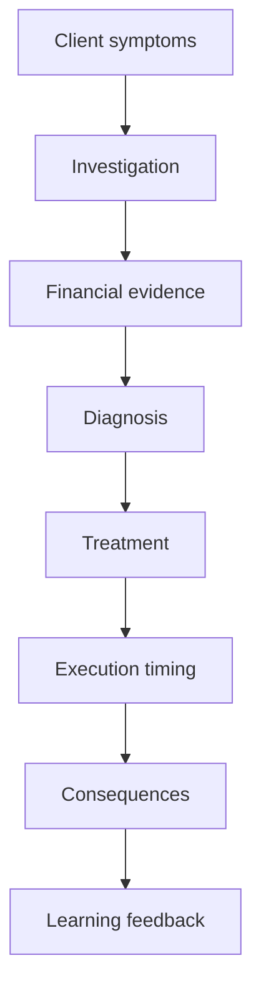
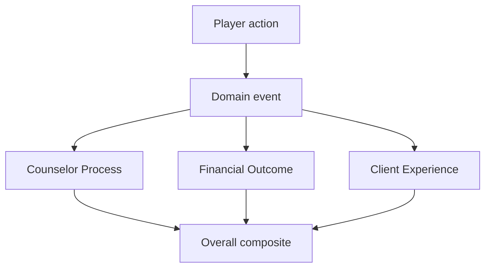

## 4. Project Logic Chain

### 4.1 Product Logic



### 4.2 Engine Logic

```text
Player edits draft selection
-> validate selection limit, cost and preconditions
-> player presses Confirm
-> read current confirmed state
-> apply immediate effects
-> evaluate conditional effects
-> write immutable next state
-> unlock evidence/content
-> emit events
-> update scoring components
-> show feedback
-> move to next node
```

### 4.3 Scoring Logic



Important separation:

| Pillar | What It Measures | What It Must Not Do |
|---|---|---|
| Counselor Process | Quality of investigation, diagnosis, treatment reasoning, communication, ethics and adaptation. | Must not improve just because the simulated outcome got lucky. |
| Financial Outcome | Simulated company survival, liquidity, debt relief and operating momentum. | Must not replace counselor competency. |
| Client Experience | Trust, understanding, willingness and stress. | Must not reward pleasing the client at the cost of accuracy. |

### 4.4 Claim Logic

Every feedback message should follow:

```text
Result -> Reason -> Meaning -> Action -> Limit
```

Example:

```text
Result: Your Chapter 11 plan failed in this run.
Reason: You filed before the holiday season without preparing suppliers, reducing success probability from 45% to 10%.
Meaning: The financial tool addressed the debt problem, but execution timing destroyed vendor trust.
Action: In a revised plan, prepare supplier communication and avoid filing immediately before the inventory build.
Limit: This probability is an educational simulation assumption, not a real bankruptcy forecast.
```

---
