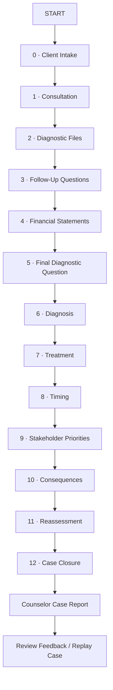

# USER FLOW

## Case #01 — Toy Kingdom Inc.

> Week 5 Product Refinement — MEDIFIN  
> **13 Screens · 6 Phases · One Complete Counseling Flow**

---

## 1. User Goal

The player acts as a **Junior Financial Counselor**.

The player's goal is to:

> **Investigate the client's financial condition, identify the primary financial problem, recommend an appropriate response, and reassess the decision after observing its consequences.**

The flow begins with the client consultation and ends with an explainable **Counselor Case Report**.

---

## 2. Main User Flow

MEDIFIN Case #01 contains **13 screens organized into 6 phases**.

| Phase | Screens | Player Action | Result |
|---|---:|---|---|
| **1. Client Intake & Investigation** | 0–5 | Understand the case, select evidence, review financial data, and ask questions | Evidence Set |
| **2. Diagnosis** | 6 | Identify relevant financial problems and determine the Primary Diagnosis | Diagnosis |
| **3. Treatment & Execution Planning** | 7–9 | Select treatment, timing, and stakeholder priorities | Execution Plan |
| **4. Consequence** | 10 | Observe developments generated by the plan | New Case State |
| **5. Reassessment** | 11 | Keep or revise professional judgment using new evidence | Final Judgment |
| **6. Final Assessment** | 12 | Review performance, company outcome, and feedback | Counselor Case Report |

### Flow Diagram



---

## 3. Screen-by-Screen Flow

| Screen | Player Does | System Does | Next Action |
|---|---|---|---|
| **0 — Client Intake** | Reviews basic client information | Introduces the case without revealing the root cause | Begin consultation |
| **1 — Consultation** | Reviews the client's presenting problem | Introduces competing explanations and financial concerns | Begin investigation |
| **2 — Diagnostic Files** | Selects **3 of 7 files** | Reveals selected evidence and locks the remaining files | Continue |
| **3 — Follow-Up Questions** | Selects **2 of 7 questions** | Reveals additional narrow evidence | Continue |
| **4 — Financial Statements** | Reviews financial statements and indicators | Provides complete financial data | Analyze evidence |
| **5 — Final Diagnostic Question** | Selects **1 of 7 questions** | Provides final clarification | Submit diagnosis |
| **6 — Diagnosis** | Identifies relevant problems and selects the **Primary Diagnosis** | Records and evaluates the diagnosis against discovered evidence | Select treatment |
| **7 — Treatment** | Selects a treatment strategy | Evaluates treatment fit and constraints | Plan execution |
| **8 — Timing** | Selects implementation timing | Records timing-related opportunities and risks | Prepare stakeholders |
| **9 — Stakeholder Priorities** | Selects **3 priorities** | Completes the execution plan | Execute plan |
| **10 — Consequences** | Reviews new developments | Generates consequences from the selected plan and case conditions | Reassess |
| **11 — Reassessment** | Keeps or revises diagnosis/treatment | Evaluates the response to new evidence | Close case |
| **12 — Case Closure** | Reviews final results and feedback | Generates Counselor Performance, Case Outcome, and final report | Review or replay |

---

## 4. Happy Path

The **Happy Path** represents a complete valid journey through the case.

```text
START
↓
Review Client
↓
Select 3 Diagnostic Files
↓
Select 2 Follow-Up Questions
↓
Review Financial Statements
↓
Select Final Question
↓
Submit Primary Diagnosis
↓
Select Treatment
↓
Select Timing
↓
Select 3 Stakeholder Priorities
↓
Observe Consequences
↓
Reassess Judgment
↓
Receive Counselor Case Report
↓
REVIEW / REPLAY
```

A successful flow means the player can complete the entire case **without needing external explanation from the team**.

It does not mean the player must choose the highest-scoring decisions.

---

## 5. Alternative Paths

MEDIFIN allows different valid decision paths while preserving the same overall flow.

### Alternative A — Different Investigation

```text
Different Evidence Selected
↓
Different Information Available
↓
Different Diagnosis Support
↓
Same Main Flow Continues
```

The player may miss important evidence but is still allowed to continue.

The consequence appears through **scoring and feedback**, rather than blocking the game.

### Alternative B — Different Treatment

```text
Same Diagnosis
↓
Different Treatment
↓
Different Timing / Stakeholders
↓
Different Consequences
↓
Different Reassessment
```

There is no treatment that automatically guarantees the best ending.

### Alternative C — Reassessment

After Screen 10, the player may:

```text
KEEP Diagnosis / Treatment
```

or:

```text
REVISE Diagnosis / Treatment
```

Both paths are valid.

The game evaluates whether the final judgment is supported by the new evidence.

---

## 6. Error & Validation Paths

The player should never reach an unclear dead end.

| Screen | Error / Invalid State | System Response |
|---|---|---|
| **2** | Fewer or more than 3 Diagnostic Files selected | `Select exactly 3 Diagnostic Files to continue.` |
| **3** | Fewer or more than 2 Follow-Up Questions selected | `Select exactly 2 Follow-Up Questions to continue.` |
| **5** | No Final Diagnostic Question selected | `Select one final question before continuing.` |
| **6** | No Primary Diagnosis selected | `Select a Primary Diagnosis before submitting your diagnosis.` |
| **7** | No Treatment selected | `Select a treatment strategy to continue.` |
| **8** | No Timing selected | `Select an implementation timing.` |
| **9** | Fewer or more than 3 Stakeholder Priorities selected | `Select exactly 3 stakeholder priorities.` |
| **11** | Revised decision is incomplete | `Complete your revised decision before closing the case.` |

### Validation Principle

```text
Invalid Input
↓
Clear Error Message
↓
Player Corrects Input
↓
Continue Flow
```

Validation should explain **what needs to be corrected**, not simply display `"Error"`.

---

## 7. Result & Next Action

The flow ends with the **Counselor Case Report**.

The final screen should show:

### Counselor Performance

- Investigation `/100`
- Diagnosis `/100`
- Treatment `/100`
- Execution Planning `/100`
- Reassessment `/100`
- **Overall Counselor Score `/100`**

### Case Outcome

- Financial Resilience
- Governance Stability
- Final Ending

### Feedback

The explanation follows:

**Result → Reason → Meaning → Action → Limit**

The player then has two clear next actions:

> **[REVIEW DECISION PATH]**

or

> **[REPLAY CASE]**

Replay allows the player to test a different investigation or decision path and compare the result.

---

## 8. Flow Ownership

| Flow Area | Primary Owner | Main Responsibility |
|---|---|---|
| **Case Entry & Scenario Flow** | Nguyễn Phương Khuê | Client presentation, scenario progression, consequence context |
| **Financial Evidence & Decision Content** | Lâm Diệu Anh | Financial information, diagnosis/treatment content, learning feedback |
| **Interface & Dialogue Flow** | Bùi Lê Trà Giang | Screen clarity, dialogue, instructions, user-facing explanations |
| **Frontend & Integration** | Trương Vĩnh Thịnh | Navigation, selection states, validation, result display, integration across screens |
| **Game Logic & State Flow** | Lê Bảo Ngọc | Decision state, scoring, consequence rules, reassessment, final outcome |

---

## 9. Logic Connection

The Week 5 user flow implements the logic already defined in Week 4.

| Flow | Logic Evidence |
|---|---|
| Overall Case Flow | [`PROJECT_LOGIC_CHAIN.md`](../WEEK%204/PROJECT_LOGIC_CHAIN.md) |
| Investigation & Diagnosis | [`DECISION_RULES_AND_SCORING.md`](../WEEK%204/DECISION_RULES_AND_SCORING.md) |
| Treatment & Execution | [`DECISION_RULES_AND_SCORING.md`](../WEEK%204/DECISION_RULES_AND_SCORING.md) |
| Consequence & Reassessment | [`PROJECT_LOGIC_CHAIN.md`](../WEEK%204/PROJECT_LOGIC_CHAIN.md) |
| Expected Final Result | [`EXPECTED_RESULT_AND_LOGIC_TEST.md`](../WEEK%204/EXPECTED_RESULT_AND_LOGIC_TEST.md) |

Week 5 therefore refines **how the user experiences the approved logic**, rather than creating a new decision model.
